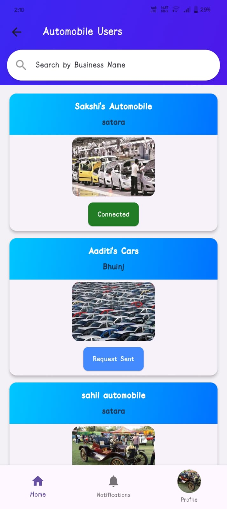

# 🚀 MarketMate

MarketMate is a Flutter-based mobile application built to empower and connect Micro, Small, and Medium Enterprises (MSMEs) in India. It provides a unified platform for businesses to collaborate, grow, manage resources, and promote eco-friendly practices.

## 📱 Features

- 🌐 **Welcome Page** with Light/Dark Mode and a "Get Started" button
- 🔐 **Secure Registration & Login**:
  - Capture user details: First Name, Last Name, CIN, Aadhaar, Email, Enterprise Name
  - User type: Admin/User
  - Email verification flow with username/password login
- 🗂️ **Business Category Selection**:
  - Categories like Agriculture, Automobile, Grocery, etc.
- ✅ **Verified Access**:
  - Only email-verified users can enter
- 💾 **Firebase Integration**:
  - Firebase Authentication
  - Firestore/Realtime Database for storing user data

## 🔧 Tech Stack

- **Frontend**: Flutter (Dart)
- **Backend & Database**: Firebase (Auth, Firestore, Realtime DB)
- **Other Tools**:
  - Firebase Console for project management
  -  VS Code for development

## 🌟 Future Enhancements

- 🧠 AI-Powered Business Recommendations
- 🕶️ Augmented Reality (AR) for product showcasing
- 💬 Real-time messaging between businesses
- 📊 Business profile management
- ♻️ Waste management and recycling network
- 🌍 Regional language support

   git clone [https://github.com/your-username/marketmate.git](https://github.com/17Pranali/Marketmate.git)

<h2>📸 Application Screenshots</h2>

  
  
  

  
  
  

  
  
  

  
  
  

  
  
  

  
  
  

  
  
  

  
  
  

  
  
  

  
  
  

  
  
  

  
  
  

  
  
  

  
  
  

  
  
  

  
  
  

  
  
  

  
  
  

